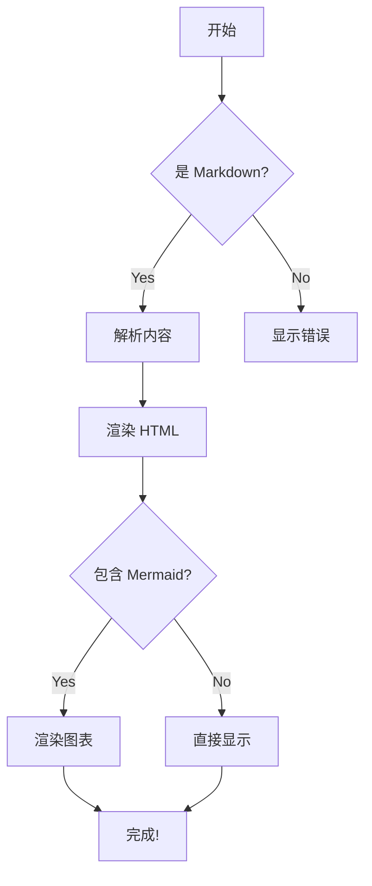
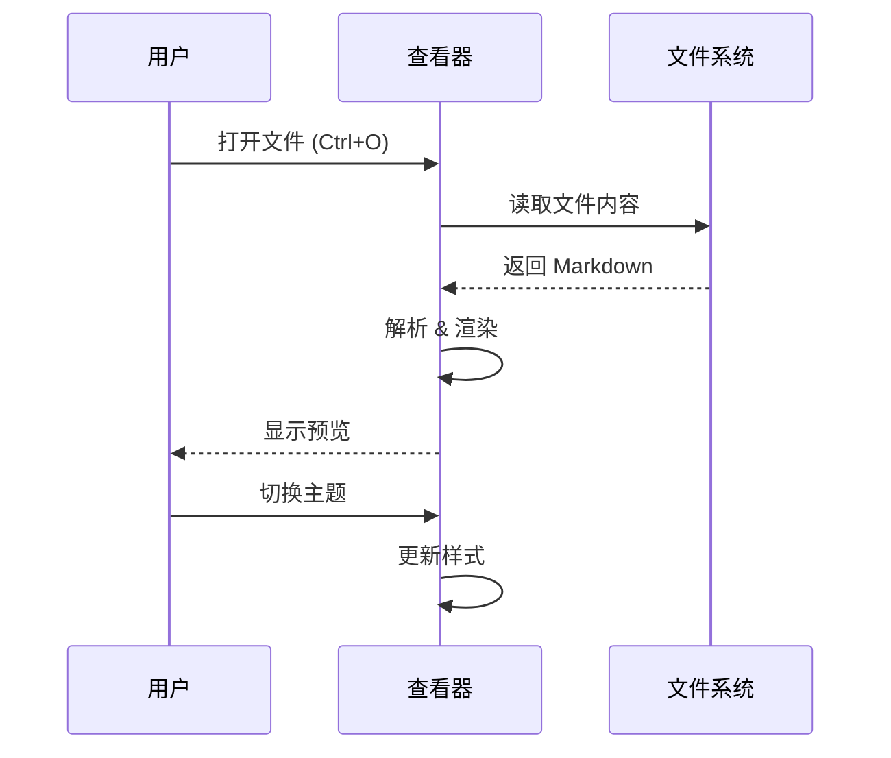
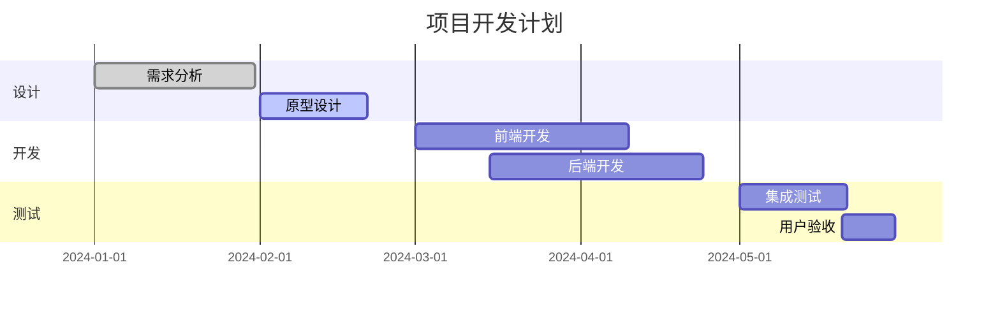
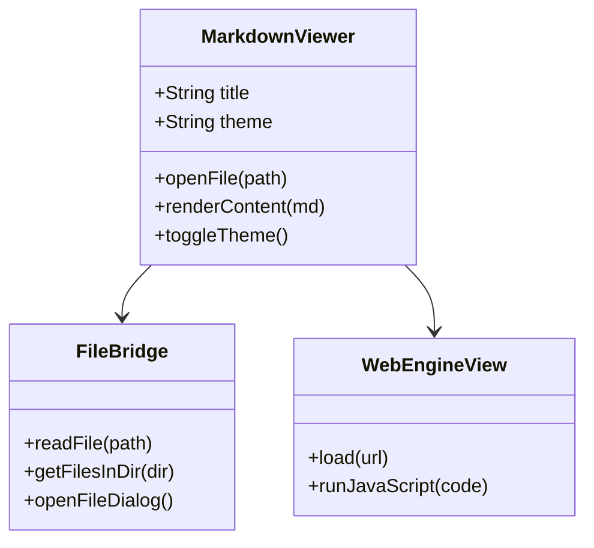
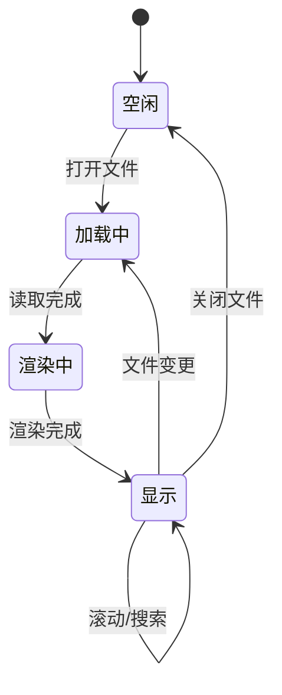

# Markdown Viewer 功能测试

> **全功能 Markdown 桌面查看器** · 支持 Mermaid / ECharts / 代码高亮 / Emoji 等

---

## 1. 基础格式

这是一段 **粗体**、*斜体*、~~删除线~~、==高亮文字== 和 `行内代码` 的混合测试。

上标: H~2~O, 下标: 29^th^

- 无序列表项 1
- 无序列表项 2
  - 嵌套项 A
  - 嵌套项 B

1. 有序列表 1
2. 有序列表 2
  1. 嵌套有序 a
  2. 嵌套有序 b

- [x] 已完成任务
- [ ] 未完成任务

---

## 2. 表格

| 功能 | 状态 | 备注 |
|:-----|:----:|:-----|
| 表格渲染 | ✅ | 支持对齐 |
| 代码高亮 | ✅ | 使用 highlight.js |
| Mermaid | ✅ | 流程图/时序图等 |
| ECharts | ✅ | 图表渲染 |
| Emoji | ✅ | :smile: :rocket: :tada: |

---

## 3. 代码高亮

```python
# Python 示例
def fibonacci(n):
    """生成斐波那契数列"""
    a, b = 0, 1
    result = []
    while a < n:
        result.append(a)
        a, b = b, a + b
    return result

print(fibonacci(100))  # [0, 1, 1, 2, 3, 5, 8, 13, 21, 34, 55, 89]
```

```javascript
// JavaScript 示例 - 带文件名标注 app.js
const greet = (name) => {
    console.log(`Hello, ${name}! 👋`);
    return `Hello, ${name}!`;
};

// 异步函数
async function fetchData(url) {
    try {
        const response = await fetch(url);
        const data = await response.json();
        return data;
    } catch (error) {
        console.error('Error:', error);
    }
}
```

```css
/* CSS 示例 styles.css */
.markdown-body {
    max-width: 820px;
    margin: 0 auto;
    padding: 32px 24px;
    line-height: 1.75;
}

.container {
    display: grid;
    grid-template-columns: repeat(auto-fill, minmax(300px, 1fr));
    gap: 16px;
}
```

```bash
# Shell 命令
$ echo "Hello World"
$ npm install
$ python main.py --verbose
$ docker compose up -d
```

---

## 4. Mermaid 图表

### 流程图



### 时序图



### 甘特图



### 类图



### 状态图



---

## 5. ECharts 图表

```echarts
{
    "title": {
        "text": "月度销售数据",
        "subtext": "2024年度",
        "left": "center"
    },
    "tooltip": {
        "trigger": "axis"
    },
    "legend": {
        "data": ["销售额", "利润"],
        "bottom": 0
    },
    "xAxis": {
        "type": "category",
        "data": ["1月", "2月", "3月", "4月", "5月", "6月", "7月", "8月"]
    },
    "yAxis": {
        "type": "value"
    },
    "series": [
        {
            "name": "销售额",
            "type": "bar",
            "data": [120, 200, 150, 80, 70, 110, 130, 190],
            "itemStyle": {
                "color": "#89b4fa"
            }
        },
        {
            "name": "利润",
            "type": "line",
            "smooth": true,
            "data": [30, 55, 40, 20, 15, 35, 45, 60],
            "itemStyle": {
                "color": "#a6e3a1"
            }
        }
    ]
}
```

```echarts
{
    "title": {
        "text": "市场份额分布",
        "left": "center"
    },
    "tooltip": {
        "trigger": "item",
        "formatter": "{b}: {c}%"
    },
    "series": [
        {
            "type": "pie",
            "radius": ["40%", "70%"],
            "center": ["50%", "55%"],
            "data": [
                {"value": 35, "name": "产品 A", "itemStyle": {"color": "#89b4fa"}},
                {"value": 25, "name": "产品 B", "itemStyle": {"color": "#a6e3a1"}},
                {"value": 20, "name": "产品 C", "itemStyle": {"color": "#f9e2af"}},
                {"value": 12, "name": "产品 D", "itemStyle": {"color": "#f38ba8"}},
                {"value": 8,  "name": "其他",  "itemStyle": {"color": "#6c7086"}}
            ],
            "label": {
                "show": true,
                "formatter": "{b}: {d}%"
            },
            "emphasis": {
                "itemStyle": {
                    "shadowBlur": 10,
                    "shadowOffsetX": 0,
                    "shadowColor": "rgba(0, 0, 0, 0.5)"
                }
            }
        }
    ]
}
```

---

## 6. 引用 & 注脚

> **设计理念**：好的工具应该让用户专注于内容本身，而不是工具的操作。
>
> —— Markdown Viewer 设计原则

这是一段带注脚的文本[^1]，这是另一个注脚[^2]。

[^1]: 这是注脚的解释内容，可以包含**格式**。
[^2]: 脚注支持多段落。

---

## 7. 自定义容器

::: info 提示信息
这是一个 `info` 类型的信息提示框，用于展示普通信息或说明。
:::

::: warning 注意
这是一个 `warning` 警告框，提醒用户注意潜在问题。
:::

::: danger 危险
这是一个 `danger` 危险提示，用于警告严重问题。
:::

::: success 完成
这是一个 `success` 成功提示，表示操作完成。
:::

::: tip 小技巧
这是一个 `tip` 技巧提示，分享实用的小建议。
:::

---

## 8. 目录

[[toc]]

---

## 9. HTML 嵌入

<details>
<summary>点击展开折叠内容</summary>

这是被折叠的内容，支持 **Markdown 格式** 和 `代码`：

- 列表项 1
- 列表项 2
- 列表项 3

</details>

<div align="center">
  <sub>HTML 对齐示例 — Markdown Viewer v1.0</sub>
</div>

---

## 10. 图片


---

## 11. 数学公式(LaTeX)

行内公式: $E = mc^2$

块级公式:

$$
\frac{-b \pm \sqrt{b^2 - 4ac}}{2a}
$$

---

## 12. 流程图(文本)

```text
┌─────────────┐
│  开始       │
└──────┬──────┘
       ▼
┌─────────────┐     ┌─────────────┐
│ 解析 Markdown├────>│ 渲染 HTML   │
└─────────────┘     └──────┬──────┘
                           ▼
                    ┌─────────────┐
                    │ 显示结果     │
                    └─────────────┘
```

---

*Markdown Viewer — 2024*
